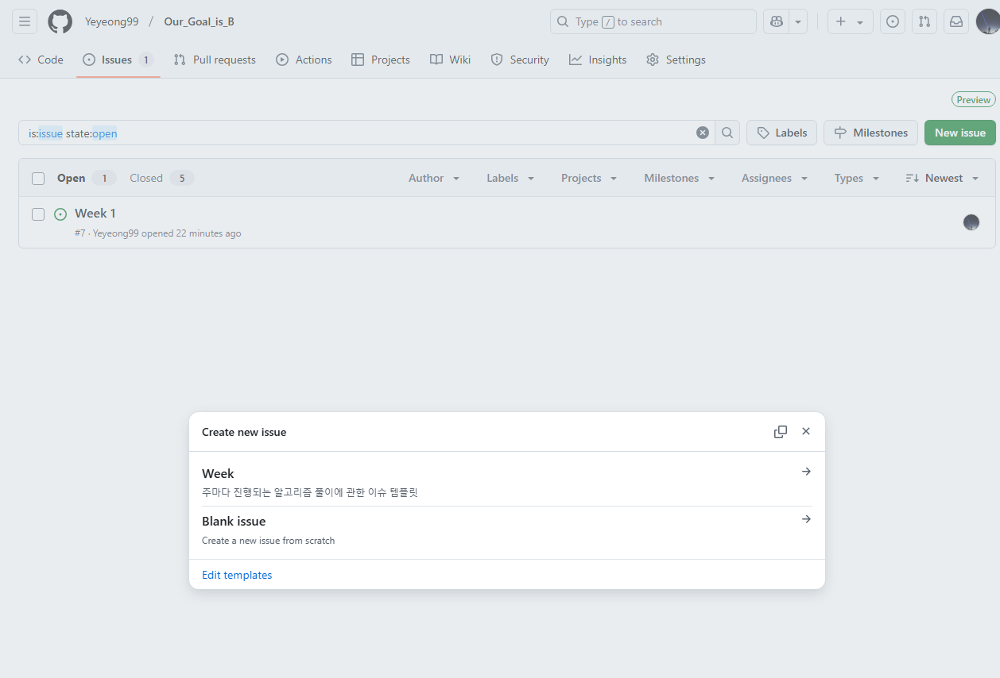
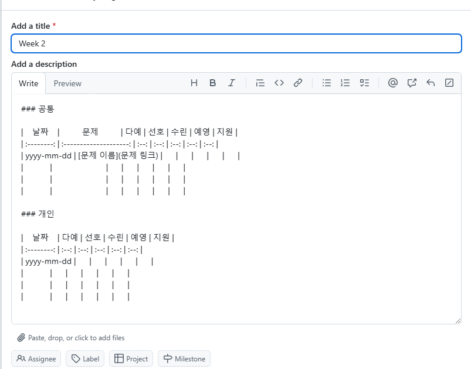
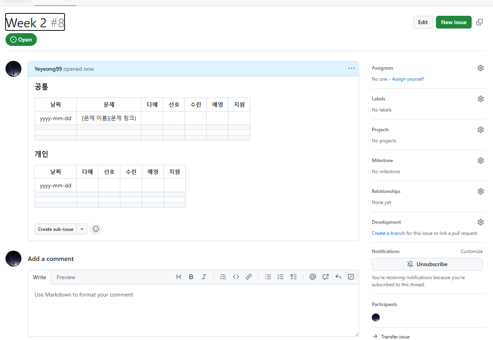
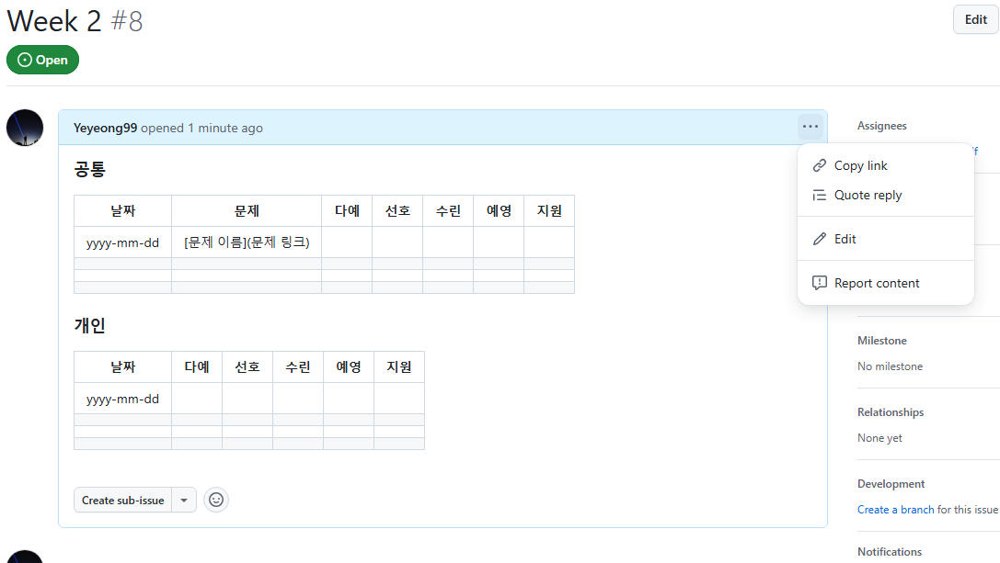
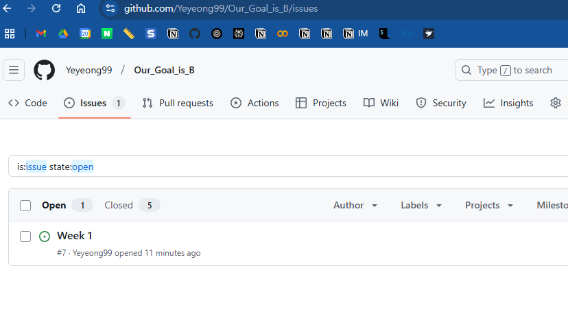
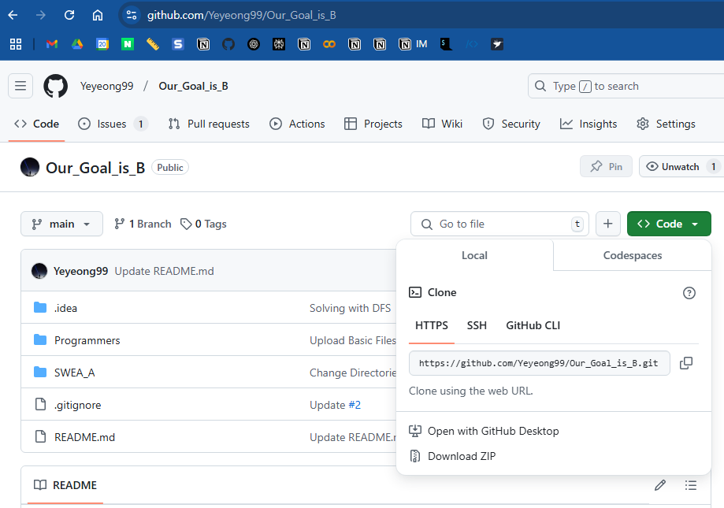
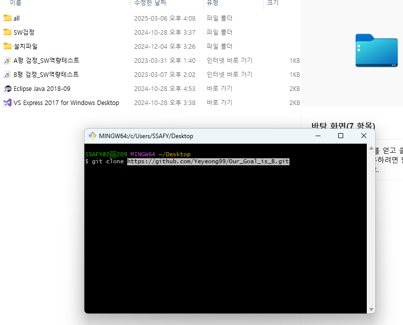
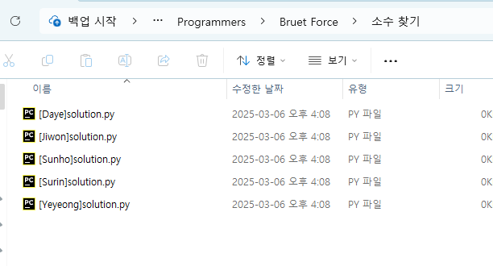
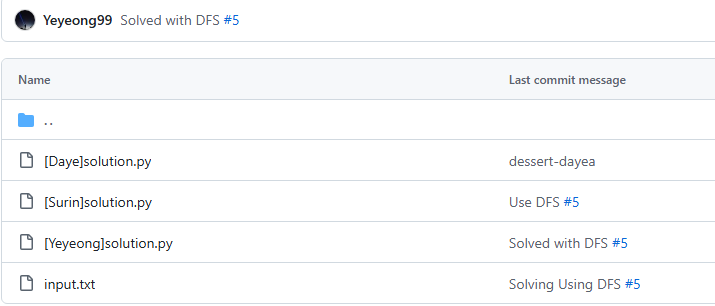
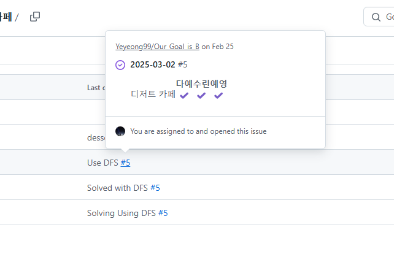

## 이슈를 커밋 메시지에 쓰는 이유가 무엇인가요?

- 문제 상황(버그, 리팩토링 등등)이 발생했을 때 이에 대해 이슈에 작성
- 이렇게 작성한 이슈를 해결한 후 해결된 코드를 커밋함
- 이 커밋과 이슈를 이어놓으면 어떤 문제를 해결한 건지 한 눈에 보이겠죠?
- 나중에 프로젝트 할 때 도움이 될 습관이라 미리 해보는 것!

## 이슈 작성하기

- 이슈 탭에서 Week 이슈 템플릿 클릭

- Add a title: 주에 해당하는 숫자로 바꾸기
- 날짜: yyyy-mm-dd 형식
- 대괄호 사이에 문제 이름 넣고 괄호 사이에 문제 링크 넣으면 문제 이름에 링크가 걸리는 형식
- 다하면 오른쪽 아래 Create

- 완성!

- 내용 수정은 여기서

## 이슈 연결하는 방법

### 이슈 확인

- 나중에 커밋할 때 필요
- 이슈 제목(이미지의 Week 1)아래 # 뒤에 번호 확인 (이미지 상 #7)

### Git Clone

- 주소를 복사

- 로컬에 클론

### 문제 풀기

- 이름에 해당하는 파일에 풀이 업로드

### 커밋할 때

- 이슈 번호 써주기
  - ex) `git commit -m "Solved #7"`

- 깃허브에 업로드 되면 이렇게 링크가 걸림

- 클릭하면 이슈로 연결됨!
